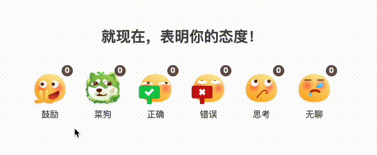
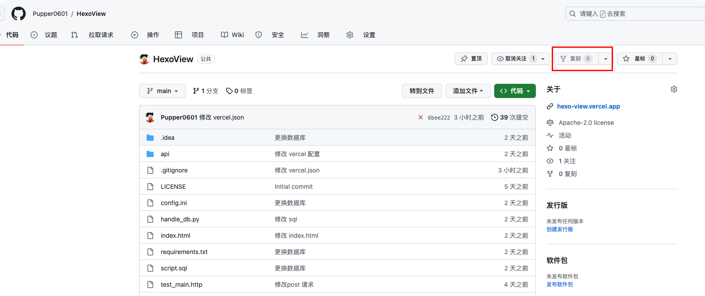
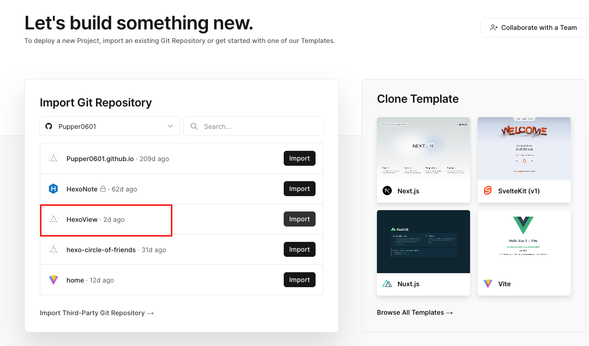
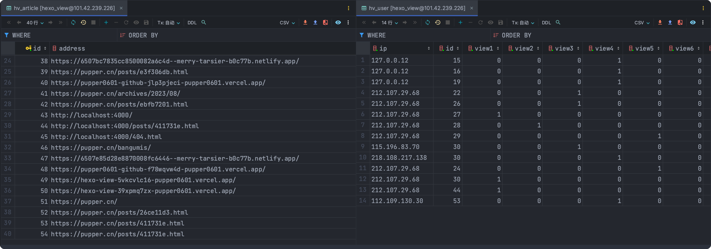
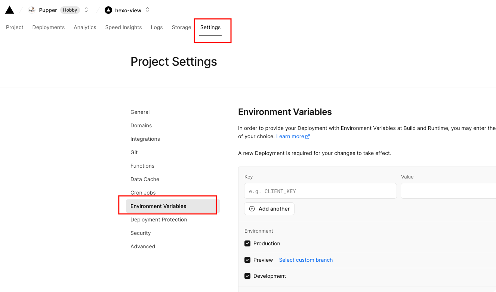
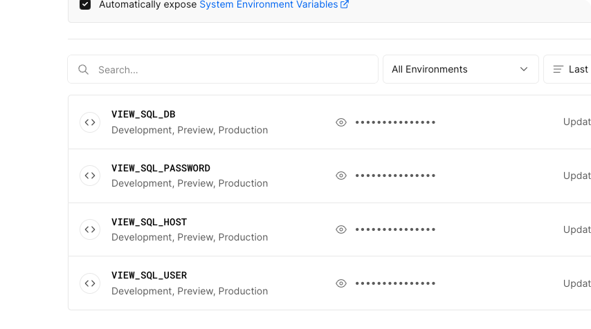

> [个人主页：](https://pupper.cn) 欢迎👏各位大佬访问。

> 注意:
> 1. 本应用需要自备 `MySQL` 数据库, 数据库表结构可以使用 `script.sql` 文件快速创建;
> 2. 最新的 css、js 请在 `index.html` 中提取;
> 3. 如果需要使用其他数据库, 请自行修改源码;

# 效果展示



# 一、前端配置

## 1.1 数据配置
在主题配置文件(`_config.anzhiyu.yaml`)添加以下内容

文章看法的数量最多 9 个

``` yaml 
view:
  enable: true
  title: "就现在，表明你的态度！"
  images:
    - src: "https://jsd.cdn.zzko.cn/npm/sticker-heo/Sticker-100/鼓掌.png"
      text: "鼓励"
    - src: "https://jsd.cdn.zzko.cn/npm/sticker-heo/Sticker-100/菜狗.png"
      text: "菜狗"
    - src: "https://jsd.cdn.zzko.cn/npm/sticker-heo/Sticker-100/正确.png"
      text: "正确"
    - src: "https://jsd.cdn.zzko.cn/npm/sticker-heo/Sticker-100/错误.png"
      text: "错误"
    - src: "https://jsd.cdn.zzko.cn/npm/sticker-heo/Sticker-100/思考.png"
      text: "思考"
    - src: "https://jsd.cdn.zzko.cn/npm/sticker-heo/Sticker-100/睡觉.png"
      text: "无聊"
```

## 1.2 页面配置

### 1.2.1 创建 view

在 `themes/anzhiyu/layout/includes/post/` 文件夹中创建 `view.pug` 文件,在文件中添加以下内容

``` pug 
if theme.view.enable !== false
	.wl-reaction
		hr
		.wl-reaction-title= theme.view.title
		ul.wl-reaction-list
			each image in theme.view.images
				li.wl-reaction-item
					.wl-reaction-img
						img(src=image.src, alt=image.text)
						.wl-reaction-votes 0
					.wl-reaction-text= image.text

```

### 1.2.2 添加页面

在 `themes/anzhiyu/layout/post.pug` 中添加以下内容

``` pug
......
          else
            - let data_type_update = theme.post_meta.post.date_type === 'updated'
            - let date_type = data_type_update ? 'updated' : 'date'
            time(itemprop="dateCreated datePublished" datetime=date_xml(page[date_type]) title=date_title + ' ' + full_date(page[date_type]))=date(page[date_type], config.date_format)
      !=page.content

+    include includes/post/view.pug

    include includes/post/post-copyright.pug
......
```

### 1.2.3 添加 js 和 css

在合适的地方添加 css 和 js, (我是单独创建一个文件,然后在配置文件中导入)

``` js 
// 更新投票数的函数
function updateVotes(data) {
    const liElements = document.querySelectorAll('.wl-reaction-item');
    liElements.forEach((li, index) => {
        const voteElement = li.querySelector('.wl-reaction-votes');
        if (voteElement) {
            voteElement.textContent = data['view' + (index + 1)];
        }
    });
}

// 发送 POST 请求的函数
function sendPostRequest(address, ip, view) {
    // 构建请求参数对象
    const data = {
        address: address,
        ip: ip,
        view: view
    };

    // 添加 view_loading 类名
    const clickedLi = document.querySelector('.wl-reaction-item.clicked');
    const voteElement = clickedLi.querySelector('.wl-reaction-votes');
    voteElement.classList.add('view_loading');

    // 发起 POST 请求
    fetch('https://hexo-view.pupper.cn/insert/', {
        method: 'POST',
        headers: {
            'Content-Type': 'application/json'
        },
        body: JSON.stringify(data)
    })
        .then(response => response.json())
        .then(data => {
            // 更新投票数
            updateVotes(data);
            // 移除 view_loading 类名
            voteElement.classList.remove('view_loading');
        })
        .catch(error => {
            // 处理请求错误
            console.error('Error:', error);
            // 移除 view_loading 类名
            voteElement.classList.remove('view_loading');
        });
}

// 发送 GET 请求的函数
function sendGetRequest(address) {
    // 发起 GET 请求
    fetch('https://hexo-view.pupper.cn/read/?address=' + encodeURIComponent(address))
        .then(response => response.json())
        .then(data => {
            // 更新投票数
            updateVotes(data);
        })
        .catch(error => {
            // 处理请求错误
            console.error('Error:', error);
        });
}

// 获取当前页面地址
const address = window.location.href;

// 获取用户网络 IP 地址（示例，实际情况可能需要使用其他方法获取）
let ip = '';

function setIP() {
    return fetch('https://api.ipify.org?format=json')
        .then(response => response.json())
        .then(data => {
            ip = data.ip;
        })
        .catch(error => {
            console.error('获取 IP 地址失败:', error);
            ip = '127.4.0.4';
        });
}

setIP().then(() => {
    console.log(ip); // 输出获取的 IP 地址或默认地址
});

// 获取所有的 li 元素
const liElements = document.querySelectorAll('.wl-reaction-item');

// 绑定点击事件处理程序
liElements.forEach((li, index) => {
    li.addEventListener('click', () => {
        const view = 'view' + (index + 1);
        console.log(address, ip, view);
        // 移除之前点击的 li 元素的 clicked 类名
        const clickedLi = document.querySelector('.wl-reaction-item.clicked');
        if (clickedLi) {
            clickedLi.classList.remove('clicked');
        }
        // 添加 clicked 类名到当前点击的 li 元素
        li.classList.add('clicked');
        sendPostRequest(address, ip, view);
    });
});

// 页面加载或刷新时自动发送 GET 请求
window.addEventListener('DOMContentLoaded', () => {
    sendGetRequest(address);
});

```

``` css
.wl-reaction {
    overflow: auto hidden;
    margin-bottom: 1.75em;
    text-align: center;
}

[data-waline] * {
    box-sizing: content-box;
    line-height: 1.75;
}

.wl-reaction-title {
    margin: 25px auto;
    font-weight: bold;
    font-size: 25px;
}

[data-waline] .wl-reaction-list {
    margin-inline-start: 0;
}

[data-waline] ol,
[data-waline] ul {
    margin-inline-start: 1.25em;
    padding: 0;
}

.wl-reaction-list {
    display: flex;
    flex-direction: row;
    gap: 30px;
    justify-content: center;
    margin: 0;
    padding: 8px;
    list-style-type: none;
}

.wl-reaction-item {
    display: flex;
    flex-direction: column;
    align-items: center;
    cursor: pointer;
}

.wl-reaction-img {
    position: relative;
    width: 60px;
    height: 60px;
}

.wl-reaction-text {
    font-size: .875em;
}

.wl-reaction img {
    width: 100%;
    height: 100%;
    transition: all 250ms ease-in-out;
}

[data-waline] img {
    max-width: 100%;
    max-height: 400px;
    border: none;
}

.wl-reaction-votes {
    position: absolute;
    top: -9px;
    inset-inline-end: -9px;
    min-width: 1.5em;
    padding: 2px;
    border: 1px solid var(--anzhiyu-theme-op-deep);
    border-radius: 1em;
    background: var(--anzhiyu-theme-op-deep);
    color: #ffffff;
    font-weight: 700;
    font-size: .75em;
    line-height: 1;
}

.wl-reaction-item:hover img,
.wl-reaction-item.active img {
    transform: scale(1.5);
}

.view_loading {
    border: 2px solid #f3f3f3;
    border-top: 2px solid #555;
    border-radius: 50%;
    width: 20px;
    height: 20px;
    display: inline-block;
    animation: spin 2s linear infinite;
}

@keyframes spin {
0% { transform: rotate(0deg); }
100% { transform: rotate(360deg); }
}

```

# 二、后端配置

## 2.1 [fork GitHub](https://github.com/Pupper0601/HexoView) 项目


在 [vercel](https://vercel.com/dashboard) 中创建项目


## 2.2 数据库配置

> 自备 MySQL 数据库
> 自备 MySQL 数据库
> 自备 MySQL 数据库

数据库表配置

```sql
-- phpMyAdmin SQL Dump
-- version 4.4.15.10
-- https://www.phpmyadmin.net
--
-- Host: localhost
-- Generation Time: 2023-09-15 17:34:55
-- 服务器版本： 5.6.50-log
-- PHP Version: 5.6.40

SET SQL_MODE = "NO_AUTO_VALUE_ON_ZERO";
SET time_zone = "+00:00";


/*!40101 SET @OLD_CHARACTER_SET_CLIENT=@@CHARACTER_SET_CLIENT */;
/*!40101 SET @OLD_CHARACTER_SET_RESULTS=@@CHARACTER_SET_RESULTS */;
/*!40101 SET @OLD_COLLATION_CONNECTION=@@COLLATION_CONNECTION */;
/*!40101 SET NAMES utf8mb4 */;

--
-- Database: `hexo_view`
--

-- --------------------------------------------------------

--
-- 表的结构 `hv_article`
--

CREATE TABLE IF NOT EXISTS `hv_article` (
  `id` int(11) NOT NULL,
  `address` text
) ENGINE=InnoDB DEFAULT CHARSET=utf8mb4;

-- --------------------------------------------------------

--
-- 表的结构 `hv_user`
--

CREATE TABLE IF NOT EXISTS `hv_user` (
  `ip` varchar(60) NOT NULL,
  `id` int(11) NOT NULL,
  `view1` int(11) NOT NULL DEFAULT '0',
  `view2` int(11) NOT NULL DEFAULT '0',
  `view3` int(11) NOT NULL DEFAULT '0',
  `view4` int(11) NOT NULL DEFAULT '0',
  `view5` int(11) NOT NULL DEFAULT '0',
  `view6` int(11) NOT NULL DEFAULT '0',
  `view7` int(11) NOT NULL DEFAULT '0',
  `view8` int(11) NOT NULL DEFAULT '0',
  `view9` int(11) NOT NULL DEFAULT '0'
) ENGINE=InnoDB DEFAULT CHARSET=utf8mb4;

--
-- Indexes for dumped tables
--

--
-- Indexes for table `hv_article`
--
ALTER TABLE `hv_article`
  ADD PRIMARY KEY (`id`);

--
-- AUTO_INCREMENT for dumped tables
--

--
-- AUTO_INCREMENT for table `hv_article`
--
ALTER TABLE `hv_article`
  MODIFY `id` int(11) NOT NULL AUTO_INCREMENT;
/*!40101 SET CHARACTER_SET_CLIENT=@OLD_CHARACTER_SET_CLIENT */;
/*!40101 SET CHARACTER_SET_RESULTS=@OLD_CHARACTER_SET_RESULTS */;
/*!40101 SET COLLATION_CONNECTION=@OLD_COLLATION_CONNECTION */;

```


## 2.3 配置环境变量

在项目的 `setting --> Environment Variables` 中创建 `VIEW_SQL_DB, VIEW_SQL_PASSWORD, VIEW_SQL_HOST, VIEW_SQL_USER` 四个连接数据库的变量






# 三、over ~
